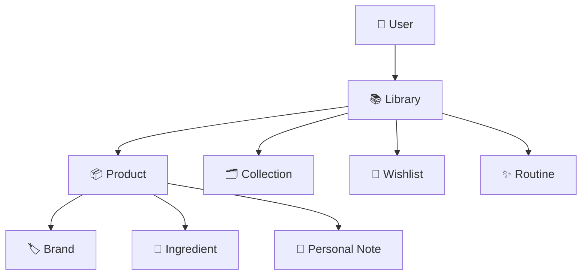

# 🌸 Data Model

> *"A great data model doesn't just store information—it reveals relationships."*

---

# Introduction

The Data Model defines the core entities that make up BloomVault and the relationships between them.

Rather than viewing the application as a collection of independent features, BloomVault is designed as a connected ecosystem where products, ingredients, brands, and personal user data work together to create a meaningful research experience.

This document serves as the foundation for database design, API development, search functionality, synchronization, and future scalability.

---

# Purpose

The Data Model aims to:

- Define the application's core entities.
- Describe how data relates to one another.
- Eliminate duplicated information.
- Promote consistency across features.
- Provide a blueprint for future database implementation.

Every entity should have a single, clearly defined responsibility.

---

# Data Model Philosophy

BloomVault follows a **product-centered data model**.

Products are the heart of the application.

Everything else either:

- Describes a product.
- Organizes a product.
- Personalizes a product.
- Helps users better understand a product.

This approach creates a consistent and intuitive structure throughout the application.

---

# Core Entities

BloomVault consists of two primary categories of data.

## Global Data

Managed by BloomVault and shared by all users.

- Products
- Brands
- Ingredients
- Categories

---

## Personal Data

Created and owned by individual users.

- User Account
- Library
- Collections
- Wishlist
- Routines
- Personal Notes

---

# High-Level Relationship

---

# Relationship Overview

The relationships between entities are intentionally simple.

| Entity | Related To |
|----------|------------|
| User | Library |
| Library | Products |
| Product | Brand |
| Product | Ingredients |
| Product | Personal Notes |
| Library | Collections |
| Library | Wishlist |
| Library | Routines |

This separation allows BloomVault to grow without introducing unnecessary complexity.

---

# Entity Responsibilities

## User

Represents an individual BloomVault account.

Responsible for:

- Authentication
- Preferences
- Personal Library

---

## Library

Acts as the user's personal beauty collection.

Responsible for:

- Saved Products
- Organization
- Personal ownership

---

## Product

The central entity of BloomVault.

Responsible for:

- Product information
- Ingredient list
- Brand relationship
- Product attributes

---

## Brand

Represents the company that manufactures products.

Responsible for:

- Brand identity
- Product catalog
- Brand information

---

## Ingredient

Represents cosmetic ingredients used within products.

Responsible for:

- Ingredient education
- Benefits
- Functions
- Safety information

---

## Collection

Represents a custom group of products created by the user.

---

## Wishlist

Represents products the user wishes to revisit or purchase.

---

## Routine

Represents an ordered sequence of products used together.

---

## Personal Note

Represents the user's personal experience with a specific product.

---

# Data Ownership

BloomVault maintains a clear separation between platform data and personal data.

| Platform Data | User Data |
|---------------|-----------|
| Products | Library |
| Brands | Collections |
| Ingredients | Wishlist |
| Categories | Routines |
| Product Metadata | Personal Notes |

Platform data is shared.

User data is private.

---

# Design Principles

The data model follows several guiding principles.

## Single Source of Truth

Every piece of information exists in one authoritative location.

---

## Separation of Concerns

Global product information is separated from personal user information.

---

## Scalability

New product categories, brands, ingredients, and features should be added without redesigning the data model.

---

## Extensibility

Future capabilities should integrate naturally into the existing relationships.

---

## Simplicity

Relationships should remain easy to understand for both developers and users.

---

# Future Expansion

The data model has been intentionally designed to support future capabilities such as:

- AI Beauty Assistant
- Barcode Scanning
- Product Timeline
- Price Tracking
- Smart Recommendations
- Community Features

These additions should extend the model rather than replace it.

---

# Data Model Summary

BloomVault's data model is centered around products and enriched through brands, ingredients, and personal user information.

This structure creates a scalable, maintainable, and intuitive foundation that supports every feature within the application.

As BloomVault grows, this model will remain the single source of truth that guides both development and future innovation.

---

> **Relationships create understanding.**

> **BloomVault**

> *Your Personal Beauty Library.*