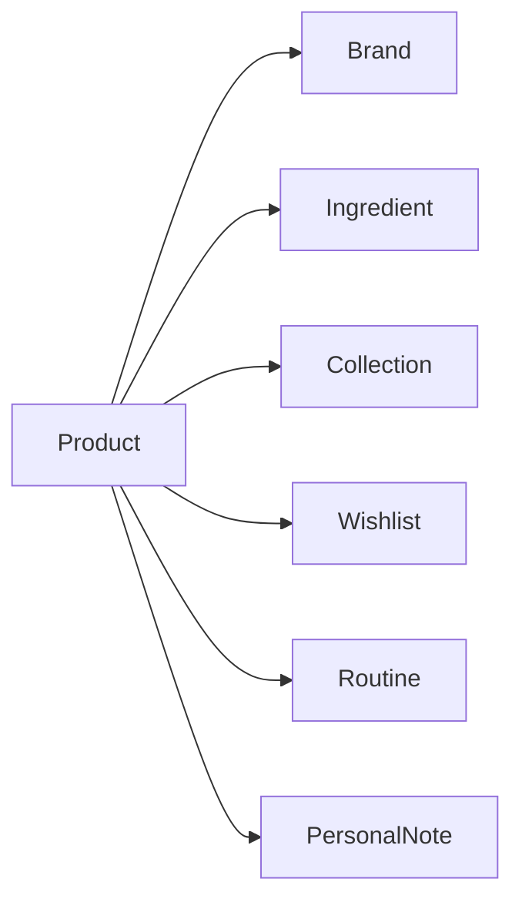

# 🌸 Product Data

> *"Every product is more than a name on a shelf—it is the foundation of a user's beauty knowledge."*

---

# Introduction

The **Product** is the central entity within BloomVault.

Nearly every feature in the application revolves around products, making it the foundation of the platform's research, organization, and learning experience.

Rather than representing a product as a simple catalog item, BloomVault models each product as a rich knowledge object that connects brands, ingredients, routines, collections, wishlists, and personal experiences.

---

# Purpose

The Product entity aims to:

- Provide accurate and comprehensive product information.
- Act as the central hub for related data.
- Support research before purchasing.
- Enable organization within the user's personal beauty library.
- Create meaningful relationships with other entities.

Every product should help users make informed decisions with confidence.

---

# Entity Overview

A Product represents a single beauty product available within BloomVault.

Each product contains its own identity, descriptive information, relationships, and system metadata.

Products are shared across all users, while user interactions with products remain personal.

---

# Canonical Product Model

```text
Product

├── Identity
├── Classification
├── Presentation
├── Composition
├── Relationships
└── Metadata
```

---

# Core Attributes

## Identity

| Field | Required | Description |
|---------|:--------:|-------------|
| Product ID | ✅ | Unique identifier |
| Name | ✅ | Official product name |
| Slug | ✅ | URL-friendly identifier |

---

## Classification

| Field | Required | Description |
|---------|:--------:|-------------|
| Brand ID | ✅ | Associated brand |
| Category | ✅ | Product category |
| Product Type | ✅ | Serum, Toner, Cleanser, etc. |

---

## Presentation

| Field | Required | Description |
|---------|:--------:|-------------|
| Description | ✅ | Product overview |
| Images | ✅ | Product images |
| Size | ⭕ | Available size(s) |
| Texture | ⭕ | Texture description |
| Color | ⭕ | Product color (if applicable) |

---

## Composition

| Field | Required | Description |
|---------|:--------:|-------------|
| Ingredient IDs | ✅ | Linked ingredients |
| Ingredient Order | ⭕ | Display order from label |

Ingredients are referenced rather than duplicated.

---

## Relationships

| Relationship | Type |
|--------------|------|
| Brand | One Product → One Brand |
| Ingredients | One Product → Many Ingredients |
| Notes | One Product → Many User Notes |
| Collections | Many-to-Many |
| Wishlist | Many-to-Many |
| Routines | Many-to-Many |

---

## Metadata

| Field | Required | Description |
|---------|:--------:|-------------|
| Created At | ✅ | Creation timestamp |
| Updated At | ✅ | Last modification |
| Data Source | ✅ | Origin of product data |
| Version | ⭕ | Data version |

---

# Product Relationships



Products act as the central hub connecting nearly every feature in BloomVault.

---

# Business Rules

- Every product must belong to exactly one brand.
- Every product must contain at least one ingredient.
- Product information is managed globally.
- User-specific information is stored separately.
- Products cannot exist without a valid identity.

---

# Validation Rules

## Required

- Product ID
- Name
- Brand ID
- Category
- Product Type
- Description
- At least one image
- At least one ingredient

---

## Optional

- Size
- Texture
- Color
- Version

---

# Data Ownership

Product data is owned and maintained by BloomVault.

Users cannot directly modify global product information.

Users may only create personal data associated with a product, such as:

- Personal Notes
- Wishlist entries
- Collection memberships
- Routine assignments

---

# Security

Global product information is read-only for users.

Administrative tools manage product creation, editing, and maintenance.

---

# Performance Considerations

Product data should:

- Load quickly.
- Support efficient searching.
- Be optimized for filtering.
- Minimize duplicated information.
- Scale to millions of products.

Relationships should use identifiers rather than embedded data wherever possible.

---

# Future Extensions

The Product entity has been designed to support future capabilities such as:

- AI-generated summaries
- Price history
- Barcode support
- Product availability
- Sustainability information
- Certifications
- Regional variants
- Product lifecycle status

These additions should extend the Product model without changing its core structure.

---

# Design Decisions

BloomVault intentionally separates product information from user information.

This ensures:

- A single source of truth.
- Reduced data duplication.
- Easier maintenance.
- Better scalability.
- Consistent product information for all users.

User interactions with products are stored independently, allowing every user to personalize their experience without affecting the shared product data.

---

# Product Data Summary

The Product entity is the heart of BloomVault.

Every research journey begins with a product and expands through its relationships with brands, ingredients, collections, routines, wishlists, and personal notes.

A well-designed Product model ensures BloomVault remains scalable, maintainable, and trusted as a personal beauty knowledge platform.

---

> **Every product tells a story. BloomVault helps users understand it.**

> **BloomVault**

> *Your Personal Beauty Library.*