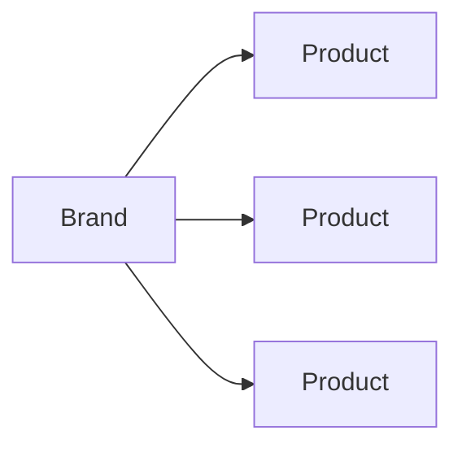

# 🌸 Brand Data

> *"Behind every product is a brand with its own story, philosophy, and identity."*

---

# Introduction

The **Brand** entity represents the company responsible for developing and marketing beauty products within BloomVault.

Rather than serving as a simple product label, each brand acts as a trusted source of context that helps users better understand the products they explore.

A Brand connects products with their origin, philosophy, and identity, allowing users to discover relationships beyond individual products.

---

# Purpose

The Brand entity aims to:

- Identify the manufacturer of a product.
- Group related products together.
- Provide educational information about each brand.
- Support product discovery through brand exploration.
- Maintain a consistent relationship between products and their creators.

---

# Entity Overview

A Brand represents a single beauty company.

Each Brand contains identifying information, descriptive content, and relationships to the products it owns.

Brands are global entities shared by every BloomVault user.

---

# Canonical Brand Model

```text
Brand

├── Identity
├── Company Information
├── Presentation
├── Relationships
└── Metadata
```

---

# Core Attributes

## Identity

| Field | Required | Description |
|---------|:--------:|-------------|
| Brand ID | ✅ | Unique identifier |
| Name | ✅ | Official brand name |
| Slug | ✅ | URL-friendly identifier |

---

## Company Information

| Field | Required | Description |
|---------|:--------:|-------------|
| Country | ⭕ | Country of origin |
| Founded Year | ⭕ | Year established |
| Description | ✅ | Brand overview |
| Philosophy | ⭕ | Brand values and mission |
| Official Website | ⭕ | Official website |

---

## Presentation

| Field | Required | Description |
|---------|:--------:|-------------|
| Logo | ✅ | Brand logo |
| Banner Image | ⭕ | Brand header image |

---

## Relationships

| Relationship | Type |
|--------------|------|
| Products | One Brand → Many Products |

---

## Metadata

| Field | Required | Description |
|---------|:--------:|-------------|
| Created At | ✅ | Creation timestamp |
| Updated At | ✅ | Last modification |
| Data Source | ✅ | Origin of brand data |
| Version | ⭕ | Data version |

---

# Brand Relationships



Every product belongs to exactly one brand.

A brand may have many products.

---

# Business Rules

- Every Brand must have a unique identifier.
- Every Brand must have a unique name.
- A Brand may exist before products are added.
- Products cannot exist without a valid Brand.
- Brand information is managed globally.

---

# Validation Rules

## Required

- Brand ID
- Name
- Slug
- Description
- Logo

---

## Optional

- Country
- Founded Year
- Philosophy
- Official Website
- Banner Image

---

# Future Database Mapping

```text
Brand

brand_id (PK)
name
slug
description
country
founded_year
philosophy
official_website
logo_url
banner_url
created_at
updated_at
data_source
version
```

---

# Data Ownership

Brand information is owned and maintained by BloomVault.

Users cannot modify global Brand information.

---

# Security

Brand data is publicly readable.

Only administrative systems may create, update, or delete Brand records.

---

# Performance Considerations

Brand data should:

- Load efficiently.
- Support quick filtering.
- Scale to thousands of brands.
- Avoid duplicated company information.

Products should reference Brand IDs instead of duplicating Brand details.

---

# Future Extensions

The Brand model is designed to support future capabilities, including:

- Brand certifications
- Sustainability initiatives
- Social media links
- Parent company relationships
- Official product collections
- Awards and recognitions

These additions should enrich the Brand profile without changing its core structure.

---

# Design Decisions

Brand information is intentionally separated from Product data.

This ensures:

- A single source of truth.
- Consistent branding across products.
- Simpler maintenance.
- Better scalability.
- Richer educational content.

Brands become destinations for exploration rather than simple product filters.

---

# Brand Data Summary

The Brand entity provides the identity behind every product in BloomVault.

By combining educational content with structured relationships, Brands help users understand not only what a product is, but also the company and philosophy behind it.

This supports BloomVault's mission of encouraging informed and intentional beauty research.

---

> **Every brand has a story. Every product begins there.**

> **BloomVault**

> *Your Personal Beauty Library.*