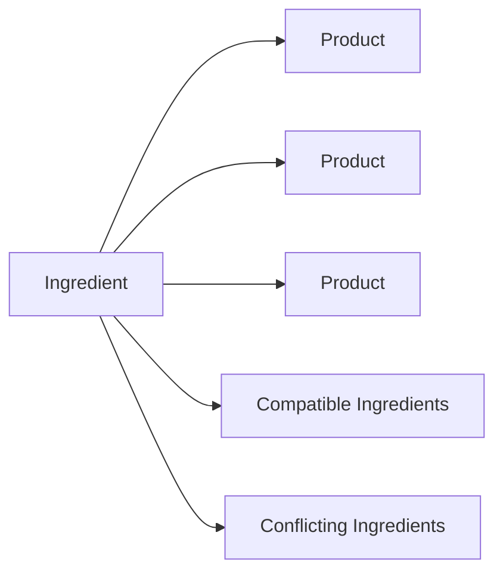

# 🌸 Ingredient Data

> *"Understanding ingredients transforms beauty routines into informed decisions."*

---

# Introduction

The **Ingredient** entity represents individual cosmetic ingredients used in beauty products throughout BloomVault.

Rather than serving as a simple item in an ingredient list, each Ingredient acts as a reusable knowledge object that provides educational information, scientific context, and practical guidance for users.

Ingredients are shared across all products, allowing BloomVault to build a connected knowledge base where users can learn not only what products contain, but also why those ingredients matter.

---

# Purpose

The Ingredient entity aims to:

- Educate users about cosmetic ingredients.
- Explain ingredient functions and benefits.
- Support informed product research.
- Connect products through shared ingredients.
- Build a reliable ingredient knowledge base.

Every ingredient should help users better understand the products they use.

---

# Entity Overview

An Ingredient represents a single cosmetic ingredient identified by its official INCI (International Nomenclature of Cosmetic Ingredients) name.

Each Ingredient contains educational information, scientific context, and relationships to products.

Ingredients are maintained globally and shared across all users.

---

# Canonical Ingredient Model

```text
Ingredient

├── Identity
├── Scientific Information
├── Educational Content
├── Suitability
├── Relationships
└── Metadata
```

---

# Core Attributes

## Identity

| Field | Required | Description |
|--------|:--------:|-------------|
| Ingredient ID | ✅ | Unique identifier |
| INCI Name | ✅ | Official cosmetic ingredient name |
| Common Name | ⭕ | User-friendly name |
| Slug | ✅ | URL-friendly identifier |

---

## Scientific Information

| Field | Required | Description |
|--------|:--------:|-------------|
| Ingredient Type | ⭕ | Humectant, Emollient, Antioxidant, etc. |
| Origin | ⭕ | Natural, Synthetic, Fermented, Bioengineered |
| Description | ✅ | Educational overview |

---

## Educational Content

| Field | Required | Description |
|--------|:--------:|-------------|
| Functions | ✅ | Primary cosmetic functions |
| Benefits | ✅ | Key benefits for the skin |
| Usage Notes | ⭕ | General usage guidance |
| Typical Concentration | ⭕ | Common effective concentration range |

---

## Suitability

| Field | Required | Description |
|--------|:--------:|-------------|
| Suitable Skin Types | ⭕ | Dry, Oily, Combination, Sensitive |
| Suitable Skin Concerns | ⭕ | Acne, Rosacea, Hyperpigmentation, Aging, etc. |
| Pregnancy Safe | ⭕ | General informational guidance |
| Beginner Friendly | ⭕ | Suitable for beginners |

---

## Relationships

| Relationship | Type |
|--------------|------|
| Products | Many Ingredients → Many Products |
| Compatible Ingredients | Many ↔ Many |
| Conflicting Ingredients | Many ↔ Many |

---

## Metadata

| Field | Required | Description |
|--------|:--------:|-------------|
| Created At | ✅ | Creation timestamp |
| Updated At | ✅ | Last modification |
| Data Source | ✅ | Origin of ingredient data |
| Version | ⭕ | Data version |

---

# Ingredient Relationships



Ingredients create meaningful connections across the BloomVault ecosystem by linking products through shared formulations and educational context.

---

# Business Rules

- Every Ingredient must have a unique identifier.
- Every Ingredient must have a valid INCI name.
- Ingredient information is managed globally.
- Ingredients may be shared across multiple products.
- Educational content should remain objective and evidence-based.

---

# Validation Rules

## Required

- Ingredient ID
- INCI Name
- Slug
- Description
- Functions
- Benefits

---

## Optional

- Common Name
- Ingredient Type
- Origin
- Usage Notes
- Typical Concentration
- Suitable Skin Types
- Suitable Skin Concerns
- Pregnancy Safe
- Beginner Friendly

---

# Future Database Mapping

```text
Ingredient

ingredient_id (PK)
inci_name
common_name
slug
ingredient_type
origin
description
functions
benefits
usage_notes
typical_concentration
suitable_skin_types
suitable_skin_concerns
pregnancy_safe
beginner_friendly
created_at
updated_at
data_source
version
```

---

# Data Ownership

Ingredient information is owned and maintained by BloomVault.

Users cannot modify global ingredient information.

Future community contributions may be reviewed before publication.

---

# Security

Ingredient information is publicly readable.

Administrative systems manage ingredient creation, updates, and verification.

---

# Performance Considerations

Ingredient data should:

- Load efficiently.
- Support fast searching.
- Be reusable across products.
- Avoid duplicated educational content.
- Scale to thousands of ingredients.

Products should reference Ingredient IDs instead of embedding ingredient information.

---

# Future Extensions

The Ingredient model has been designed to support future capabilities, including:

- Scientific references
- Clinical studies
- Ingredient safety ratings
- Regulatory status by country
- Alternative ingredient suggestions
- Ingredient timelines
- AI-generated educational summaries

These additions should enrich the Ingredient knowledge base without changing its core structure.

---

# Design Decisions

Ingredient information is intentionally modeled as an independent knowledge entity rather than embedded within products.

This approach ensures:

- A single source of truth.
- Consistent educational content.
- Reduced data duplication.
- Better scalability.
- Richer ingredient exploration.

Products reference ingredients, while ingredients maintain their own educational identity.

---

# Ingredient Data Summary

The Ingredient entity forms the educational foundation of BloomVault.

By transforming cosmetic ingredients into reusable knowledge objects, BloomVault empowers users to move beyond product labels and develop a deeper understanding of skincare and beauty formulations.

Every ingredient contributes to BloomVault's mission of making beauty research organized, meaningful, and personal.

---

> **Knowledge begins with understanding what goes into every product.**

> **BloomVault**

> *Your Personal Beauty Library.*