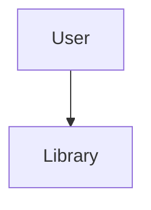

# 🌸 User Data

> *"Every user brings a unique beauty journey. BloomVault provides the space to make it personal."*

---

# Introduction

The **User** entity represents an individual BloomVault account.

Unlike product, brand, and ingredient data—which are shared globally—the User entity serves as the foundation for personalization.

Rather than directly owning every piece of personal information, each User owns a single **Library**, which contains their saved products, collections, wishlist, routines, notes, and other personalized content.

This separation keeps authentication, account information, and personal beauty data organized, scalable, and easy to maintain.

---

# Purpose

The User entity aims to:

- Represent an authenticated BloomVault account.
- Store account and profile information.
- Maintain user preferences.
- Connect each user to a single personal Library.
- Provide a secure identity throughout the platform.

The User does not directly store beauty-related content. Instead, it acts as the owner of a personalized Library.

---

# Entity Overview

A User represents one registered BloomVault account.

Each User has:

- One account
- One profile
- One Library

The Library becomes the user's personal beauty workspace where all personalized experiences take place.

---

# Canonical User Model

```text
User

├── Identity
├── Profile
├── Preferences
├── Relationships
└── Metadata
```

---

# Core Attributes

## Identity

| Field | Required | Description |
|--------|:--------:|-------------|
| User ID | ✅ | Unique identifier |
| Authentication ID | ✅ | Linked authentication provider ID |
| Email | ✅ | Account email address |

---

## Profile

| Field | Required | Description |
|--------|:--------:|-------------|
| Display Name | ✅ | User's chosen display name |
| Profile Photo | ⭕ | Avatar image |
| Bio | ⭕ | Optional personal description |

---

## Preferences

| Field | Required | Description |
|--------|:--------:|-------------|
| Preferred Language | ⭕ | Display language |
| Theme Preference | ⭕ | Light, Dark, or System |
| Notification Preferences | ⭕ | User notification settings |

---

## Relationships

| Relationship | Type |
|--------------|------|
| Library | One User → One Library |

---

## Metadata

| Field | Required | Description |
|--------|:--------:|-------------|
| Created At | ✅ | Account creation timestamp |
| Updated At | ✅ | Last profile update |
| Last Sign-In | ⭕ | Most recent login |

---

# User Relationships



The User owns a single Library, which contains all personal beauty data.

---

# Business Rules

- Every User must have a unique identifier.
- Every User must have one associated Library.
- A User cannot have multiple Libraries.
- User accounts are created through the authentication system.
- Personal beauty data is stored within the Library, not directly on the User.

---

# Validation Rules

## Required

- User ID
- Authentication ID
- Email
- Display Name

---

## Optional

- Profile Photo
- Bio
- Preferred Language
- Theme Preference
- Notification Preferences
- Last Sign-In

---

# Future Database Mapping

```text
User

user_id (PK)
auth_id
email
display_name
profile_photo_url
bio
preferred_language
theme_preference
notification_preferences
created_at
updated_at
last_sign_in
```

---

# Data Ownership

User accounts belong to the individual account holder.

Users have full control over their profile information and preferences.

BloomVault manages account integrity, authentication, and platform-level security.

---

# Security & Privacy

User information is private.

Sensitive account data is protected through authentication and authorization mechanisms.

Personal profile information is only visible according to the user's privacy settings and future sharing capabilities.

---

# Performance Considerations

User data should:

- Load quickly during authentication.
- Remain lightweight.
- Separate authentication from profile information.
- Avoid storing large collections of personal beauty data directly within the User entity.

This keeps account management efficient while allowing the Library to grow independently.

---

# Future Extensions

The User model has been designed to support future capabilities, including:

- Multiple authentication providers
- Account verification
- Profile customization
- Privacy settings
- Connected devices
- Personalized AI preferences

These additions should enhance the user experience without changing the User's core responsibility.

---

# Design Decisions

BloomVault intentionally separates the User from personal beauty content.

The User is responsible for identity and preferences.

The Library is responsible for organization and personalization.

This clear separation simplifies the data model, improves scalability, and aligns with BloomVault's philosophy of treating the Library as the user's personal beauty workspace.

---

# User Data Summary

The User entity provides identity, personalization, and secure access to BloomVault.

Rather than managing beauty data directly, the User serves as the gateway to a single personal Library, creating a clean separation between account management and the user's evolving beauty journey.

---

> **Your account opens the door. Your Library tells your story.**

> **BloomVault**

> *Your Personal Beauty Library.*