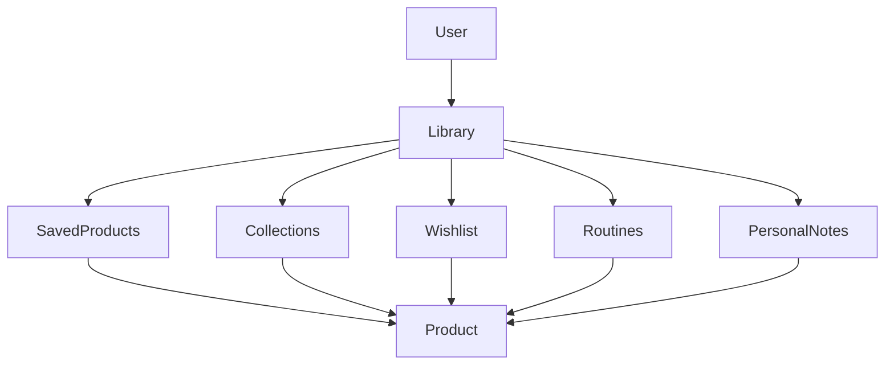

# 🌸 Personal Library

> *"Every saved product becomes part of a growing collection of beauty knowledge."*

---

# Introduction

The **Personal Library** is the heart of every user's BloomVault experience.

While Products, Brands, and Ingredients form the shared knowledge available to everyone, the Personal Library is where that knowledge becomes personal.

It serves as the user's private beauty workspace, bringing together saved products, collections, wishlists, routines, and personal notes into one organized and searchable place.

Rather than acting as a simple list of saved items, the Library grows alongside the user, reflecting their interests, discoveries, and evolving beauty journey.

---

# Purpose

The Personal Library aims to:

- Organize beauty products in one place.
- Personalize the research experience.
- Connect all user-created content.
- Provide a central hub for future features.
- Preserve the user's beauty journey over time.

The Library is the user's personal knowledge base.

---

# Entity Overview

Each User owns exactly one Personal Library.

The Library contains references to all personal entities, including:

- Saved Products
- Collections
- Wishlist
- Routines
- Personal Notes

The Library does not duplicate product information.

Instead, it references shared Product data while storing the user's personal organization and interactions.

---

# Canonical Library Model

```text
Personal Library

├── Saved Products
├── Collections
├── Wishlist
├── Routines
├── Personal Notes
└── Metadata
```

---

# Core Components

## Saved Products

Represents every product the user has intentionally added to their Library.

These products become the foundation for organization and personalization.

---

## Collections

Custom groups created by the user to organize products based on any theme or purpose.

Examples include:

- Morning Routine Ideas
- Korean Skincare
- Products to Repurchase
- Acne Care

---

## Wishlist

A collection of products the user is interested in purchasing or researching further.

Wishlist items remain connected to the Library until removed or saved.

---

## Routines

Structured sequences of products organized for daily, weekly, or customized beauty routines.

Routines reference products already available in the Library.

---

## Personal Notes

Private reflections, observations, and experiences associated with individual products.

Notes help users remember why a product worked—or didn't.

---

# Library Relationships



The Library acts as the bridge between the user and BloomVault's shared product knowledge.

---

# Business Rules

- Every User owns one Personal Library.
- A Library cannot exist without a User.
- All personal beauty data belongs within the Library.
- Products remain globally managed by BloomVault.
- Personal entities reference Products instead of duplicating them.

---

# Validation Rules

## Required

- Library ID
- User ID

---

## Optional

The Library itself contains minimal data.

Most information exists within the entities it manages.

---

# Future Database Mapping

```text
Library

library_id (PK)
user_id (FK)
created_at
updated_at
```

Related entities:

- Saved Products
- Collections
- Wishlist
- Routines
- Personal Notes

---

# Data Ownership

The Personal Library belongs entirely to the individual user.

Users have full control over the organization and content of their Library.

BloomVault never modifies a user's personal organization without explicit user action.

---

# Security & Privacy

All Library content is private by default.

Personal products, collections, notes, and routines are visible only to the account owner unless future sharing features are introduced.

---

# Performance Considerations

The Library should:

- Load efficiently.
- Scale to thousands of saved products.
- Support fast searching and filtering.
- Maintain responsive organization tools.

Relationships should rely on references rather than duplicating global product data.

---

# Future Extensions

The Personal Library has been designed to support future capabilities, including:

- Smart Collections
- AI-powered organization
- Reading history
- Product timelines
- Archive functionality
- Shared collections
- Collaborative libraries

These enhancements should build upon the Library without changing its core purpose.

---

# Design Decisions

BloomVault intentionally treats the Personal Library as the center of the user's experience rather than a simple bookmarking feature.

By separating shared product knowledge from personal organization, the Library becomes a living collection that evolves with the user's interests, routines, and discoveries.

This design reinforces BloomVault's philosophy of encouraging thoughtful research and meaningful organization over impulsive consumption.

---

# Personal Library Summary

The Personal Library is the foundation of every personalized experience within BloomVault.

It transforms global beauty information into a private, organized, and evolving knowledge base that reflects each user's unique beauty journey.

As users explore, save, organize, and learn, their Library becomes increasingly valuable over time.

---

> **Knowledge becomes meaningful when it becomes personal.**

> **BloomVault**

> *Your Personal Beauty Library.*