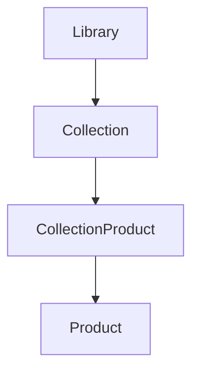

# 🌸 Collections

> *"Every collection tells a story about what matters to you."*

---

# Introduction

Collections allow users to organize products in meaningful and personal ways.

Rather than being limited to predefined categories, users can create their own collections based on routines, interests, goals, seasons, ingredients, brands, or any organization that makes sense to them.

Collections transform a growing Library into a thoughtfully curated beauty knowledge base.

---

# Purpose

The Collections entity aims to:

- Help users organize saved products.
- Support flexible personal categorization.
- Make products easier to revisit.
- Encourage thoughtful curation.
- Create a personalized browsing experience.

Collections reflect how users think about beauty, not how products are categorized.

---

# Entity Overview

A Collection belongs to one Personal Library.

Each Collection contains references to one or more Products through a collection membership relationship.

Users may create, edit, rename, reorder, archive, or delete their own Collections at any time.

---

# Canonical Collection Model

```text
Collection

├── Identity
├── Presentation
├── Membership
└── Metadata
```

---

# Core Attributes

## Identity

| Field | Required | Description |
|--------|:--------:|-------------|
| Collection ID | ✅ | Unique identifier |
| Library ID | ✅ | Owning Personal Library |
| Name | ✅ | Collection name |

---

## Presentation

| Field | Required | Description |
|--------|:--------:|-------------|
| Description | ⭕ | Optional description |
| Cover Product | ⭕ | Featured product |
| Color | ⭕ | User-selected accent color |
| Icon | ⭕ | Optional icon or emoji |

---

## Membership

| Field | Required | Description |
|--------|:--------:|-------------|
| Product Count | ✅ | Number of products |
| Sort Order | ⭕ | Custom ordering |

---

## Metadata

| Field | Required | Description |
|--------|:--------:|-------------|
| Created At | ✅ | Creation timestamp |
| Updated At | ✅ | Last modification |
| Archived | ⭕ | Archive status |

---

# Collection Relationships



Collections organize products without duplicating product information.

---

# Business Rules

- Every Collection belongs to one Personal Library.
- Collection names must be unique within the same Library.
- A Collection may contain zero or more Products.
- Products may belong to multiple Collections.
- Deleting a Collection does not delete Products.

---

# Validation Rules

## Required

- Collection ID
- Library ID
- Name

---

## Optional

- Description
- Cover Product
- Color
- Icon
- Archived

---

# Future Database Mapping

```text
Collection

collection_id (PK)
library_id (FK)
name
description
cover_product_id
color
icon
created_at
updated_at
archived
```

```
CollectionProduct

collection_id (FK)
product_id (FK)
added_at
display_order
```

---

# Data Ownership

Collections belong entirely to the owning user.

Only the owner may create, edit, archive, reorder, or delete Collections.

---

# Security & Privacy

Collections are private by default.

Future versions may introduce optional sharing or collaborative collections without changing the underlying data model.

---

# Performance Considerations

Collections should:

- Load quickly.
- Support drag-and-drop reordering.
- Scale to hundreds of Collections and thousands of products.
- Efficiently retrieve products without duplicating data.

---

# Future Extensions

The Collections model has been designed to support:

- Nested collections
- Smart collections
- Shared collections
- Collaborative collections
- AI-generated collections
- Collection templates
- Public collections

These enhancements build upon the existing structure while preserving user ownership and flexibility.

---

# Design Decisions

BloomVault treats Collections as personal curation rather than simple folders.

Users are free to organize products in whatever way feels meaningful to them.

A single product may belong to multiple Collections, allowing one product to support many different research journeys without duplication.

---

# Collections Summary

Collections give users the freedom to organize their Library in a way that reflects their own thinking, preferences, and beauty goals.

Rather than forcing a fixed structure, BloomVault empowers every user to create a Library that feels uniquely theirs.

---

> **A collection is more than a folder—it is a reflection of your beauty journey.**

> **BloomVault**

> *Your Personal Beauty Library.*