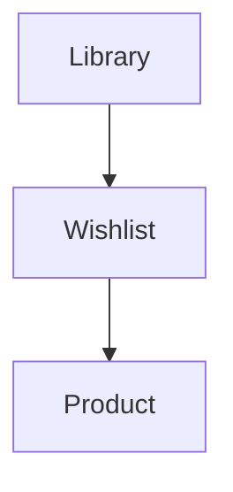

# 🌸 Wishlist

> *"Every saved product represents curiosity, not commitment."*

---

# Introduction

The Wishlist allows users to keep track of beauty products they are interested in exploring, researching, or purchasing in the future.

Rather than acting as a shopping cart, the Wishlist serves as a space for curiosity.

It helps users remember products that caught their attention while giving them the freedom to continue researching before deciding whether a product belongs in their Personal Library.

---

# Purpose

The Wishlist entity aims to:

- Save products of future interest.
- Support ongoing product research.
- Organize potential purchases.
- Reduce forgotten discoveries.
- Encourage thoughtful decision-making.

Wishlist items represent possibilities rather than commitments.

---

# Entity Overview

A Wishlist belongs to one Personal Library.

Each Wishlist item references a Product and stores optional personal context, allowing users to remember why they saved a product and what they plan to do next.

Products may move from the Wishlist into the Library as the user's research progresses.

---

# Canonical Wishlist Model

```text
Wishlist

├── Identity
├── Wishlist Items
├── Personal Context
└── Metadata
```

---

# Core Attributes

## Identity

| Field | Required | Description |
|--------|:--------:|-------------|
| Wishlist Item ID | ✅ | Unique identifier |
| Library ID | ✅ | Owning Personal Library |
| Product ID | ✅ | Referenced Product |

---

## Personal Context

| Field | Required | Description |
|--------|:--------:|-------------|
| Reason Saved | ⭕ | Why the product was added |
| Priority | ⭕ | Low, Medium, High |
| Status | ⭕ | Researching, Ready to Buy, Purchased |
| Reminder Date | ⭕ | Optional reminder |

---

## Metadata

| Field | Required | Description |
|--------|:--------:|-------------|
| Added At | ✅ | Date added |
| Updated At | ✅ | Last modification |

---

# Wishlist Relationships



Wishlist items reference shared Product data without duplicating product information.

---

# Business Rules

- Every Wishlist item belongs to one Personal Library.
- A Product may appear only once in a user's Wishlist.
- Wishlist items may be removed at any time.
- Wishlist items do not duplicate Product information.
- Moving a Product into the Library does not automatically remove it from the Wishlist unless the user chooses to do so.

---

# Validation Rules

## Required

- Wishlist Item ID
- Library ID
- Product ID
- Added At

---

## Optional

- Reason Saved
- Priority
- Status
- Reminder Date

---

# Future Database Mapping

```text
WishlistItem

wishlist_item_id (PK)
library_id (FK)
product_id (FK)
reason_saved
priority
status
reminder_date
added_at
updated_at
```

---

# Data Ownership

Wishlist items belong entirely to the owning user.

Users have full control over creating, editing, and removing Wishlist items.

---

# Security & Privacy

Wishlist content is private by default.

Future versions may support optional sharing without changing the underlying data model.

---

# Performance Considerations

Wishlist data should:

- Load quickly.
- Support filtering by status and priority.
- Scale to hundreds of saved products.
- Reference Product data efficiently without duplication.

---

# Future Extensions

The Wishlist model has been designed to support:

- Price tracking
- Restock notifications
- Sale alerts
- AI purchase recommendations
- Priority sorting
- Shared wishlists
- Import from external links

These additions should enrich the Wishlist while preserving its role as a research-first feature.

---

# Design Decisions

BloomVault intentionally treats the Wishlist as a research tool rather than a shopping tool.

By allowing users to save context, priorities, and research status, the Wishlist becomes a living record of curiosity and consideration instead of a simple list of products to purchase.

This design encourages thoughtful exploration over impulsive buying.

---

# Wishlist Summary

The Wishlist captures the products that spark a user's interest.

It provides a dedicated space to remember discoveries, continue research, and make intentional decisions before products become part of the user's Personal Library.

---

> **Curiosity begins here. Confidence follows with research.**

> **BloomVault**

> *Your Personal Beauty Library.*