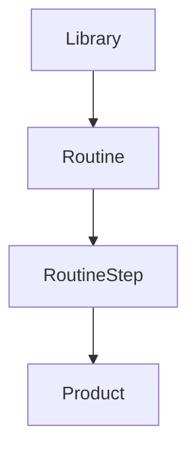

# 🌸 Routines

> *"A routine is more than a list of products—it's a reflection of how you care for your skin."*

---

# Introduction

The **Routine** entity allows users to organize products into structured skincare or beauty routines.

Rather than serving as a reminder or habit tracker, Routines help users understand the order, purpose, and consistency of the products they use.

Each Routine is built from products already saved in the user's Personal Library, making it a natural extension of their beauty research and organization.

---

# Purpose

The Routine entity aims to:

- Organize products into structured routines.
- Define the order in which products are used.
- Support morning, evening, or custom routines.
- Help users visualize their skincare regimen.
- Encourage intentional and consistent product usage.

Routines provide structure without adding unnecessary complexity.

---

# Entity Overview

A Routine belongs to one Personal Library.

Each Routine contains one or more Routine Steps.

Each Routine Step references a Product and defines its position within the routine.

---

# Canonical Routine Model

```text
Routine

├── Identity
├── Schedule
├── Routine Steps
└── Metadata
```

---

# Core Attributes

## Identity

| Field | Required | Description |
|--------|:--------:|-------------|
| Routine ID | ✅ | Unique identifier |
| Library ID | ✅ | Owning Personal Library |
| Name | ✅ | Routine name |

---

## Schedule

| Field | Required | Description |
|--------|:--------:|-------------|
| Routine Type | ⭕ | Morning, Evening, Weekly, Custom |
| Frequency | ⭕ | Daily, Weekly, Custom |

---

## Metadata

| Field | Required | Description |
|--------|:--------:|-------------|
| Created At | ✅ | Creation timestamp |
| Updated At | ✅ | Last modification |

---

# Routine Step Model

Each Routine consists of one or more Routine Steps.

| Field | Required | Description |
|--------|:--------:|-------------|
| Step ID | ✅ | Unique identifier |
| Routine ID | ✅ | Parent Routine |
| Product ID | ✅ | Referenced Product |
| Step Number | ✅ | Position within the routine |
| Step Note | ⭕ | Optional personal note |

Routine Steps determine the order of product application while keeping Product information centralized.

---

# Routine Relationships



Routines reference Products without duplicating product information.

---

# Business Rules

- Every Routine belongs to one Personal Library.
- A Routine contains one or more Routine Steps.
- Each Routine Step references one Product.
- Products may appear in multiple Routines.
- Users may freely reorder Routine Steps.

---

# Validation Rules

## Required

- Routine ID
- Library ID
- Name
- At least one Routine Step

---

## Optional

- Routine Type
- Frequency
- Step Note

---

# Future Database Mapping

```text
Routine

routine_id (PK)
library_id (FK)
name
routine_type
frequency
created_at
updated_at
```

```text
RoutineStep

step_id (PK)
routine_id (FK)
product_id (FK)
step_number
step_note
```

---

# Data Ownership

Routines belong entirely to the owning user.

Users have full control over creating, editing, reordering, and deleting their Routines.

---

# Security & Privacy

Routine data is private by default.

Future versions may support optional sharing while preserving user ownership.

---

# Performance Considerations

Routine data should:

- Load quickly.
- Support drag-and-drop step reordering.
- Scale to multiple routines containing many products.
- Reference Product data without duplication.

---

# Future Extensions

The Routine model has been designed to support:

- Multiple routines per day
- Seasonal routines
- Routine templates
- AI routine suggestions
- Ingredient conflict detection
- Smart routine optimization
- Shared routines

These enhancements should build upon the existing structure while keeping Routines easy to understand and manage.

---

# Design Decisions

BloomVault intentionally focuses on routine organization rather than routine tracking.

The goal is to help users build and understand their skincare routines—not to replace dedicated reminder or habit-tracking applications.

By separating Routines from Products through Routine Steps, the system remains flexible, scalable, and easy to maintain.

---

# Routine Summary

Routines help users transform their Personal Library into practical skincare regimens.

By organizing products into meaningful sequences, BloomVault bridges the gap between research and everyday use while keeping the experience simple, thoughtful, and personal.

---

> **Knowledge becomes routine. Routine becomes confidence.**

> **BloomVault**

> *Your Personal Beauty Library.*