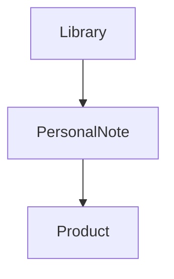

# 🌸 Personal Notes

> *"The most valuable beauty knowledge is often your own."*

---

# Introduction

Personal Notes allow users to record their own experiences, observations, and thoughts about products in their Personal Library.

Rather than maintaining a separate journal, Notes are attached directly to the products they relate to, making personal knowledge easier to find and revisit.

Every note adds context that cannot be found in product descriptions or ingredient lists.

Over time, these observations become one of the most valuable parts of a user's Personal Library.

---

# Purpose

The Personal Notes entity aims to:

- Capture personal product experiences.
- Record observations over time.
- Preserve product-related memories.
- Support future purchasing decisions.
- Build a personalized beauty knowledge base.

Notes transform product research into personal experience.

---

# Entity Overview

A Personal Note belongs to one Personal Library.

Each Note references a single Product and contains the user's private observations about that product.

Users may create multiple Notes for the same Product as their experiences evolve.

---

# Canonical Note Model

```text
Personal Note

├── Identity
├── Content
├── Relationships
└── Metadata
```

---

# Core Attributes

## Identity

| Field | Required | Description |
|--------|:--------:|-------------|
| Note ID | ✅ | Unique identifier |
| Library ID | ✅ | Owning Personal Library |
| Product ID | ✅ | Referenced Product |

---

## Content

| Field | Required | Description |
|--------|:--------:|-------------|
| Observation | ✅ | User's note |
| Title | ⭕ | Optional short title |
| Tags | ⭕ | Optional personal tags |

---

## Metadata

| Field | Required | Description |
|--------|:--------:|-------------|
| Created At | ✅ | Creation timestamp |
| Updated At | ✅ | Last modification |

---

# Note Relationships



Notes reference Products while remaining completely private to the owning user.

---

# Business Rules

- Every Note belongs to one Personal Library.
- Every Note references one Product.
- Users may create multiple Notes for the same Product.
- Notes do not modify Product information.
- Notes remain private by default.

---

# Validation Rules

## Required

- Note ID
- Library ID
- Product ID
- Observation

---

## Optional

- Title
- Tags

---

# Future Database Mapping

```text
PersonalNote

note_id (PK)
library_id (FK)
product_id (FK)
title
observation
tags
created_at
updated_at
```

---

# Data Ownership

Personal Notes belong entirely to the owning user.

Only the owner may create, edit, or delete Notes.

BloomVault never modifies the content of a user's Notes.

---

# Security & Privacy

Personal Notes are private by default.

They are never visible to other users unless future sharing capabilities are explicitly introduced.

---

# Performance Considerations

Personal Notes should:

- Load efficiently alongside Product details.
- Support searching by keyword.
- Scale as users build long-term product histories.
- Remain lightweight and responsive.

---

# Future Extensions

The Personal Notes model has been designed to support:

- Photo attachments
- Voice notes
- Rich text formatting
- Ratings
- Timeline view
- AI-generated summaries
- Search by sentiment

These enhancements should build upon the existing structure while preserving the simplicity of personal observations.

---

# Design Decisions

BloomVault intentionally embeds Notes within the product experience rather than creating a standalone journaling feature.

This keeps observations connected to the products they describe, making personal knowledge easier to revisit and more meaningful over time.

By focusing on product-specific reflections, BloomVault encourages users to build a practical, experience-based beauty library.

---

# Personal Notes Summary

Personal Notes capture the knowledge that only the user can provide.

They preserve experiences, observations, and lessons learned, transforming a collection of products into a truly personal beauty resource.

---

> **Products provide information. Your experiences provide wisdom.**

> **BloomVault**

> *Your Personal Beauty Library.*