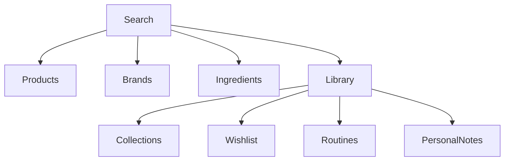

# 🌸 Search Data

> *"Knowledge is only valuable when you can find it."*

---

# Introduction

Search is one of the core capabilities of BloomVault.

Rather than limiting users to searching only products, BloomVault provides a unified search experience across the entire platform.

A single search can surface Products, Brands, Ingredients, Collections, Wishlist items, Routines, and Personal Notes, allowing users to quickly find both shared knowledge and their own personal content.

Search transforms BloomVault from a collection of information into an accessible knowledge platform.

---

# Purpose

The Search capability aims to:

- Help users quickly discover information.
- Search across both global and personal data.
- Reduce navigation complexity.
- Surface relevant results from multiple sources.
- Encourage exploration and learning.

Search is designed to connect users with knowledge, not simply locate records.

---

# Search Scope

BloomVault supports searching across multiple domains.

## Global Knowledge

- Products
- Brands
- Ingredients

---

## Personal Knowledge

- Personal Library
- Collections
- Wishlist
- Routines
- Personal Notes

---

# Search Architecture

```text
Search Query

↓

Search Engine

↓

Knowledge Sources

├── Products
├── Brands
├── Ingredients
├── Library
├── Collections
├── Wishlist
├── Routines
└── Personal Notes

↓

Ranked Results
```

The Search Engine aggregates results from multiple knowledge sources and presents them in a unified experience.

---

# Searchable Fields

## Products

- Product Name
- Product Description
- Category
- Brand
- Ingredient Names

---

## Brands

- Brand Name
- Country
- Description

---

## Ingredients

- INCI Name
- Common Name
- Functions
- Benefits

---

## Collections

- Collection Name
- Description

---

## Wishlist

- Product Name
- Reason Saved

---

## Routines

- Routine Name

---

## Personal Notes

- Note Title
- Observation
- Tags

---

# Search Relationships



The Search Engine acts as a unified entry point into both shared and personal knowledge.

---

# Business Rules

- Users may search across all accessible data.
- Personal results are only visible to their owner.
- Search results may contain multiple entity types.
- Results should be ranked by relevance.
- Empty searches should return suggested or recent content.

---

# Validation Rules

Search queries should:

- Support partial matches.
- Ignore letter casing.
- Tolerate common typing mistakes.
- Return results even when only part of a keyword is entered.

---

# Future Database Considerations

Search may eventually be powered by:

- PostgreSQL Full-Text Search
- Supabase Search capabilities
- Dedicated search indexes
- Vector search for semantic matching

The implementation should remain independent of the user experience.

---

# Data Ownership

Search does not own data.

It indexes and retrieves information from existing BloomVault entities.

Search respects the ownership and visibility rules of each entity it accesses.

---

# Security & Privacy

Personal search results are only visible to the authenticated user.

Global content remains publicly searchable where appropriate.

Search must always enforce authorization before returning results.

---

# Performance Considerations

Search should:

- Return results quickly.
- Support incremental search as users type.
- Rank the most relevant matches first.
- Scale efficiently as the product catalog and user libraries grow.

Frequently searched data may be indexed or cached to improve responsiveness.

---

# Future Extensions

The Search capability has been designed to support:

- AI-powered search
- Natural language queries
- Semantic search
- Voice search
- Barcode search
- Image search
- Search history
- Saved searches
- Personalized ranking
- Smart suggestions

These enhancements should improve discovery while preserving a simple and intuitive search experience.

---

# Design Decisions

BloomVault intentionally treats Search as a platform capability rather than a product lookup tool.

By searching across both global knowledge and each user's Personal Library, Search becomes the fastest way to rediscover information, continue research, and connect ideas throughout the platform.

This unified approach reinforces BloomVault's mission of making beauty knowledge organized, meaningful, and easy to explore.

---

# Search Summary

Search connects every part of the BloomVault ecosystem.

From Products and Ingredients to Collections and Personal Notes, it allows users to discover, revisit, and organize beauty knowledge through a single, intelligent search experience.

---

> **Search everything. Discover anything.**

> **BloomVault**

> *Your Personal Beauty Library.*