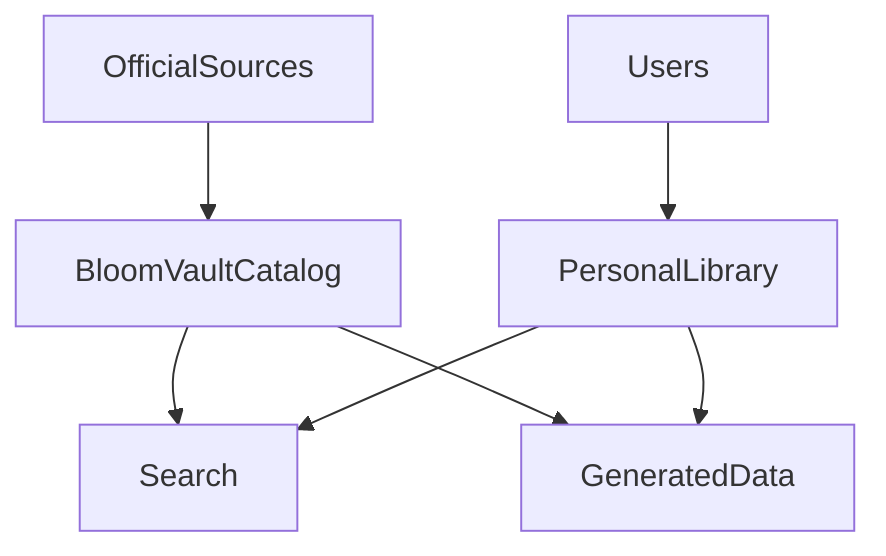

# 🌸 Data Sources

> *"Reliable knowledge begins with reliable data."*

---

# Introduction

BloomVault is built on the principle that beauty research should be based on trustworthy and well-structured information.

To achieve this, the platform separates data according to its origin and ownership.

Rather than relying on a single source, BloomVault combines official product information, user-generated content, and internally generated data to create a reliable and scalable beauty knowledge platform.

---

# Purpose

The Data Sources model aims to:

- Define where BloomVault's data originates.
- Establish clear ownership of different data types.
- Promote reliability and consistency.
- Support future automation and integrations.
- Reduce dependency on manual data entry.

---

# Data Categories

BloomVault manages three primary categories of data.

## Global Data

Global Data represents information shared by every user.

Examples include:

- Products
- Brands
- Ingredients
- Categories
- Ingredient relationships

This information is maintained by BloomVault and remains consistent across all users.

---

## Personal Data

Personal Data belongs exclusively to individual users.

Examples include:

- Personal Library
- Collections
- Wishlist
- Routines
- Personal Notes
- Preferences

This information is private and fully controlled by its owner.

---

## Generated Data

Generated Data is created automatically by the platform.

Examples include:

- Search indexes
- Recommendation models
- Popular products
- Usage statistics
- AI-generated insights
- Cached metadata

Generated Data improves the platform without replacing authoritative information.

---

# Primary Data Sources

BloomVault may obtain Global Data from trusted sources such as:

- Official brand websites
- Manufacturer product information
- Public ingredient databases
- Regulatory agencies
- Licensed beauty data providers
- Curated internal reviews

Each source should be evaluated for reliability, completeness, and licensing requirements before integration.

---

# Data Flow

The BloomVault Catalog acts as the central source of truth for shared beauty information.

---

# Source Validation

Before new Global Data is accepted, BloomVault should verify:

- Accuracy
- Completeness
- Consistency
- Licensing permissions
- Source credibility

Conflicting information should be reviewed before publication.

---

# Business Rules

- Global Data must originate from trusted sources.
- Personal Data is created and managed by users.
- Generated Data must not overwrite authoritative information.
- All imported data should remain traceable to its original source.

---

# Data Ownership

| Data Type | Owner |
|-----------|-------|
| Global Data | BloomVault |
| Personal Data | User |
| Generated Data | BloomVault |

Ownership determines who may create, modify, and manage each type of data.

---

# Security & Privacy

Data protection varies by category.

Global Data is broadly accessible.

Personal Data remains private to the owning user.

Generated Data must never expose sensitive personal information.

---

# Performance Considerations

BloomVault should:

- Cache frequently accessed Global Data.
- Keep Personal Data isolated per user.
- Generate indexes asynchronously.
- Optimize data synchronization for scalability.

---

# Future Integrations

The Data Sources architecture has been designed to support future integrations, including:

- Official brand APIs
- Ingredient databases
- Barcode lookup services
- Product image providers
- Retail partner integrations
- AI enrichment services

New sources should integrate without changing the existing domain model.

---

# Design Decisions

BloomVault intentionally separates data by origin rather than storing all information uniformly.

This distinction improves reliability, simplifies maintenance, and provides a clear foundation for future integrations and automation.

By treating official information, personal knowledge, and generated insights as separate but connected data sources, BloomVault creates a platform that is both trustworthy and adaptable.

---

# Data Sources Summary

BloomVault's data ecosystem is built upon trusted global information, user-owned personal knowledge, and intelligently generated platform data.

Together, these sources create a comprehensive and reliable foundation for beauty research while preserving data quality, ownership, and scalability.

---

> **Great decisions begin with trustworthy information.**

> **BloomVault**

> *Your Personal Beauty Library.*