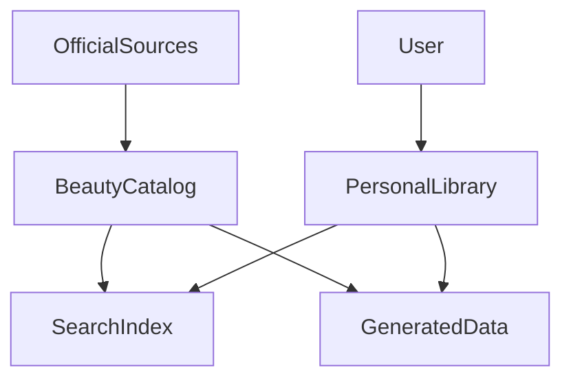

# 🌸 Data Synchronization

> *"Knowledge remains valuable when it stays accurate, consistent, and up to date."*

---

# Introduction

BloomVault relies on data synchronization to ensure that information remains consistent across the platform.

As users interact with their Personal Library and BloomVault continuously improves its Beauty Catalog, synchronization keeps all related data aligned without requiring manual intervention.

The synchronization process is designed to be reliable, efficient, and largely invisible to the user.

---

# Purpose

The Data Synchronization model aims to:

- Keep Global Data current.
- Synchronize Personal Library changes.
- Maintain generated platform data.
- Preserve consistency across devices.
- Minimize unnecessary data processing.

Synchronization should happen automatically whenever possible.

---

# Synchronization Categories

BloomVault performs synchronization across three primary categories.

## Global Synchronization

Global Synchronization updates the BloomVault Beauty Catalog using trusted external sources.

Examples include:

- Product information
- Brand information
- Ingredient information
- Product images
- Ingredient relationships

These updates improve the shared knowledge available to all users.

---

## Personal Synchronization

Personal Synchronization keeps each user's Personal Library consistent across their devices.

Examples include:

- Saved Products
- Collections
- Wishlist
- Routines
- Personal Notes
- User Preferences

Changes made on one device should become available on all authenticated devices.

---

## Generated Synchronization

Generated Synchronization refreshes data created by BloomVault itself.

Examples include:

- Search indexes
- Recommendation models
- AI-generated insights
- Usage statistics
- Cached metadata

Generated data should always reflect the latest authoritative information.

---

# Synchronization Flow

Synchronization ensures that changes propagate throughout the platform while preserving data ownership.

---

# Business Rules

- Global Data should synchronize from trusted sources.
- Personal changes should synchronize automatically.
- Generated data should refresh after relevant changes.
- Synchronization must never overwrite user-owned content.
- Failed synchronization should not corrupt existing data.

---

# Conflict Resolution

When synchronization conflicts occur:

- User-owned content always takes priority over generated data.
- Official catalog updates replace outdated catalog information.
- Generated data should be regenerated rather than manually corrected.
- Conflicts should be logged for future review.

---

# Offline Support

BloomVault should support temporary offline usage where practical.

Examples include:

- Viewing previously loaded Library content.
- Creating Notes while offline.
- Editing Collections offline.

Changes should synchronize automatically once connectivity is restored.

---

# Error Handling

If synchronization fails, BloomVault should:

- Preserve local changes.
- Retry synchronization automatically.
- Notify the user only when manual action is required.
- Record synchronization errors for diagnostics.

---

# Security & Privacy

Synchronization must:

- Respect user authentication.
- Encrypt transmitted data.
- Never expose one user's Personal Library to another.
- Apply authorization before synchronizing protected data.

---

# Performance Considerations

Synchronization should:

- Transfer only changed data where possible.
- Avoid unnecessary full refreshes.
- Run efficiently in the background.
- Prioritize responsiveness during active user interactions.

---

# Future Extensions

The synchronization architecture has been designed to support:

- Real-time collaboration
- Multi-device synchronization
- Background synchronization
- Incremental updates
- Intelligent conflict resolution
- Event-driven synchronization

These enhancements should improve the user experience while preserving reliability and scalability.

---

# Design Decisions

BloomVault separates synchronization into Global, Personal, and Generated categories to reflect the different ownership and lifecycle of each data type.

This separation simplifies system behavior, reduces unnecessary processing, and provides a scalable foundation for future integrations and intelligent platform features.

---

# Data Synchronization Summary

Data Synchronization ensures that BloomVault remains accurate, consistent, and responsive.

By keeping the Beauty Catalog, Personal Library, and generated platform data aligned, BloomVault provides users with a seamless experience while maintaining the integrity of its knowledge platform.

---

> **Knowledge should evolve quietly. Your experience should remain effortless.**

> **BloomVault**

> *Your Personal Beauty Library.*