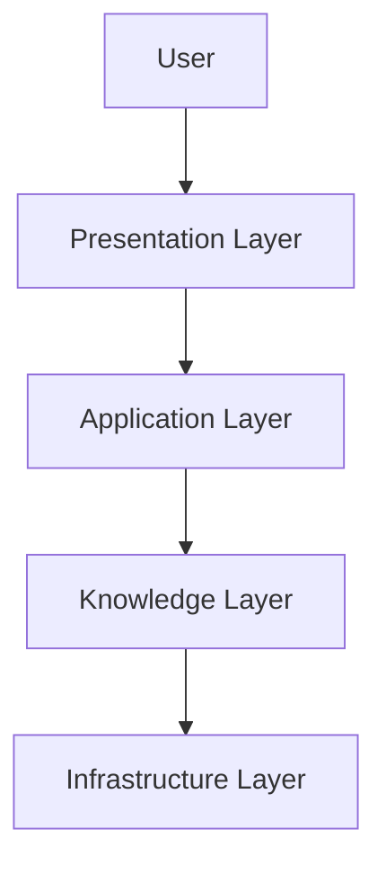

# 🌸 System Overview

> *"A great architecture makes complexity feel simple."*

---

# Introduction

The BloomVault system is designed as a modern, cloud-based knowledge platform that helps users research, organize, and preserve beauty knowledge.

Rather than centering the architecture around technical frameworks, BloomVault is organized around the flow of knowledge throughout the platform.

This layered architecture separates presentation, business logic, domain knowledge, and infrastructure, allowing each part of the system to evolve independently while remaining easy to understand and maintain.

---

# Purpose

The System Overview aims to:

- Provide a high-level view of the platform.
- Explain how major components interact.
- Establish architectural boundaries.
- Support future scalability.
- Create a common understanding for developers and AI coding agents.

---

# System Architecture

BloomVault is organized into four architectural layers.

Each layer has a clearly defined responsibility.

---

# Presentation Layer

The Presentation Layer contains everything users directly interact with.

Responsibilities include:

- User Interface
- Navigation
- Screen rendering
- User interactions
- Accessibility
- Responsive layouts

Primary technologies:

- React Native
- Expo
- TypeScript

---

# Application Layer

The Application Layer contains the business logic that powers BloomVault.

Core capabilities include:

- Authentication
- Search
- Collections
- Wishlist
- Product Comparison
- Routines
- Personal Notes
- Settings

This layer coordinates user actions while remaining independent of presentation and infrastructure.

---

# Knowledge Layer

The Knowledge Layer represents the heart of BloomVault.

It contains the platform's two primary knowledge domains.

## Beauty Catalog

Shared knowledge available to all users.

Includes:

- Products
- Brands
- Ingredients

---

## Personal Library

Private knowledge owned by each user.

Includes:

- Saved Products
- Collections
- Wishlist
- Routines
- Personal Notes

The Knowledge Layer defines the relationships that were established throughout Volume IV.

---

# Infrastructure Layer

The Infrastructure Layer provides the technical foundation for the platform.

Responsibilities include:

- Database
- Authentication
- File Storage
- Search Indexing
- APIs
- Cloud Services

Primary technologies:

- Supabase
- PostgreSQL
- Supabase Auth
- Supabase Storage

---

# System Flow

A typical user interaction follows this sequence.

The system separates user interaction, business logic, knowledge management, and infrastructure to improve maintainability and scalability.

---

# Architectural Principles

BloomVault follows several core architectural principles.

- Separation of responsibilities
- Knowledge-centered design
- Modular components
- Scalable infrastructure
- Secure by default
- AI-friendly architecture

These principles guide every technical decision throughout the platform.

---

# Future Growth

The layered architecture allows BloomVault to support future capabilities without major redesigns.

Examples include:

- AI-powered recommendations
- Semantic search
- Barcode scanning
- Community features
- Web application
- Desktop application
- Third-party integrations

The architecture is designed to evolve while preserving clear boundaries between layers.

---

# Design Decisions

BloomVault intentionally organizes its architecture around knowledge rather than technology.

Frameworks, databases, and cloud providers may change over time, but the concepts of shared knowledge, personal knowledge, and platform capabilities remain constant.

This approach creates an architecture that is resilient, understandable, and adaptable to future technological changes.

---

# System Overview Summary

The BloomVault architecture combines modern cloud technologies with a knowledge-centered design philosophy.

By separating presentation, business logic, knowledge, and infrastructure into independent layers, the platform remains scalable, maintainable, and well-prepared for future growth.

---

> **Technology supports the platform. Knowledge defines it.**

> **BloomVault**

> *Your Personal Beauty Library.*