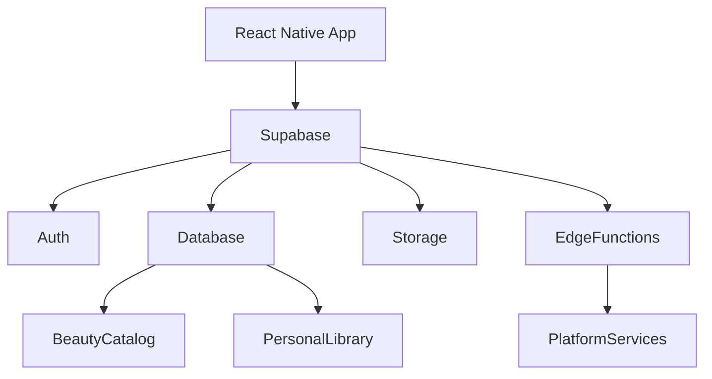

# 🌸 Backend Architecture

> *"A strong backend quietly powers every great user experience."*

---

# Introduction

The BloomVault backend provides the services responsible for storing, protecting, and managing the platform's knowledge.

Rather than following a traditional monolithic server architecture, BloomVault leverages Supabase as its Backend-as-a-Service (BaaS), allowing the platform to focus on business capabilities rather than infrastructure management.

The backend is organized around BloomVault's core knowledge domains rather than technical implementation details.

---

# Purpose

The Backend Architecture aims to:

- Provide reliable data management.
- Secure user information.
- Support scalable platform growth.
- Simplify backend development.
- Enable future integrations and AI capabilities.

---

# Technology Stack

BloomVault's backend is built using:

- Supabase
- PostgreSQL
- Supabase Auth
- Supabase Storage
- Supabase Realtime
- Supabase Edge Functions

These services provide a secure and scalable backend foundation with minimal operational overhead.

---

# Backend Domains

The backend is organized into three primary domains.

## 🌍 Beauty Catalog

Shared information available to all users.

Responsibilities include:

- Products
- Brands
- Ingredients
- Catalog relationships
- Catalog maintenance

---

## 📚 Personal Library

Private information owned by individual users.

Responsibilities include:

- Saved Products
- Collections
- Wishlist
- Routines
- Personal Notes
- User Preferences

Each user's data is isolated through Row Level Security (RLS).

---

## ⚙️ Platform Services

Supporting capabilities used across the platform.

Responsibilities include:

- Authentication
- Search
- File Storage
- Synchronization
- AI integrations
- Analytics

These services enhance the platform while remaining independent of the knowledge domains.

---

# Backend Architecture

The backend separates infrastructure from business domains, promoting scalability and maintainability.

---

# Data Access

All application data is accessed through Supabase services.

Examples include:

- Product retrieval
- User authentication
- Personal Library updates
- Image storage
- Search operations

The frontend communicates with Supabase rather than directly interacting with the database.

---

# Security

Security is enforced through multiple layers.

Examples include:

- Row Level Security (RLS)
- Supabase Auth
- JWT authentication
- Secure storage
- Permission policies

Sensitive user data remains protected by default.

---

# Business Logic

Most business logic should reside within the frontend application or Supabase Edge Functions.

Examples include:

- AI processing
- External API integrations
- Background synchronization
- Scheduled tasks

Keeping the backend lightweight improves maintainability.

---

# Performance

The backend should prioritize:

- Efficient database queries
- Indexed search
- Secure caching
- Optimized storage access
- Scalable cloud infrastructure

Performance optimizations should preserve simplicity wherever possible.

---

# Future Growth

The backend architecture supports future capabilities including:

- AI-powered recommendations
- Barcode scanning
- Semantic search
- External beauty data providers
- Community features
- Administrative tools

New services should integrate without disrupting existing domain boundaries.

---

# Design Decisions

BloomVault intentionally adopts a Backend-as-a-Service architecture.

By relying on managed backend services, the platform reduces operational complexity while allowing development to focus on product features and knowledge management.

This architecture aligns with BloomVault's principles of simplicity, scalability, and maintainability.

---

# Backend Architecture Summary

The BloomVault backend combines Supabase's managed services with a domain-driven architectural approach.

By separating Beauty Catalog, Personal Library, and Platform Services into clear backend responsibilities, the platform remains secure, scalable, and ready for future expansion.

---

> **Reliable platforms are built on dependable foundations.**

> **BloomVault**

> *Your Personal Beauty Library.*