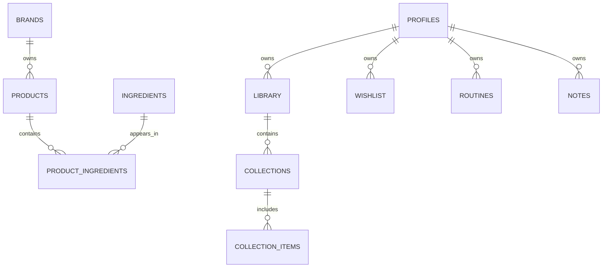

# 🌸 Database Architecture

> *"A well-designed database preserves relationships as carefully as it stores information."*

---

# Introduction

The BloomVault database is the foundation of the platform's knowledge.

Built on PostgreSQL through Supabase, the database stores both the shared Beauty Catalog and each user's Personal Library while maintaining clear relationships between entities.

The database design emphasizes consistency, scalability, and long-term maintainability.

---

# Purpose

The Database Architecture aims to:

- Organize BloomVault's knowledge.
- Maintain data integrity.
- Support efficient querying.
- Protect user information.
- Enable future platform growth.

---

# Database Technology

BloomVault uses:

- PostgreSQL
- Supabase Database

PostgreSQL provides a robust relational database well suited for managing interconnected beauty knowledge.

---

# Database Domains

The database is organized into three primary domains.

## 🌍 Beauty Catalog

Shared knowledge available to every user.

Core entities include:

- Products
- Brands
- Ingredients
- Product Ingredients
- Categories

---

## 📚 Personal Library

Private knowledge owned by users.

Core entities include:

- Profiles
- Saved Products
- Collections
- Collection Items
- Wishlist
- Routines
- Personal Notes

Each user's records are isolated through Row Level Security (RLS).

---

## ⚙️ Platform

Supporting platform data.

Examples include:

- Settings
- Search Indexes
- Audit Logs
- System Configuration

These entities support platform functionality without becoming part of the Beauty Catalog or Personal Library.

---

# Entity Relationships

The relationships mirror the domain model established in Volume IV.

---

# Database Principles

BloomVault follows several database principles.

- Normalize shared data.
- Minimize duplication.
- Enforce referential integrity.
- Protect user-owned data.
- Keep relationships explicit.

These principles improve consistency and simplify long-term maintenance.

---

# Constraints

The database should enforce:

- Primary Keys
- Foreign Keys
- Unique Constraints
- Required Fields
- Check Constraints where appropriate

Validation should occur as close to the data as possible.

---

# Security

Database security includes:

- Row Level Security (RLS)
- Authenticated access
- Role-based permissions
- Secure policies
- Encrypted connections

Security is enforced at the database level whenever possible.

---

# Performance

The database should support:

- Indexed search
- Efficient joins
- Pagination
- Optimized relationship queries
- Scalable catalog growth

Performance optimizations should preserve readability and maintainability.

---

# Future Growth

The database architecture supports future capabilities such as:

- Product version history
- Community features
- AI-generated metadata
- Semantic search
- Barcode indexing
- Analytics

Future tables should extend existing domains rather than introducing unrelated structures.

---

# Design Decisions

BloomVault organizes its database around knowledge domains rather than isolated technical entities.

This mirrors the overall product architecture and creates a database that is intuitive for developers, AI coding agents, and future contributors.

By preserving strong relationships between entities, the database becomes a reliable foundation for every feature built on top of it.

---

# Database Architecture Summary

The BloomVault database combines PostgreSQL's relational capabilities with a domain-driven structure centered around the Beauty Catalog, Personal Library, and Platform services.

This architecture ensures that BloomVault remains reliable, scalable, and easy to evolve as the platform grows.

---

> **Relationships give knowledge its meaning.**

> **BloomVault**

> *Your Personal Beauty Library.*