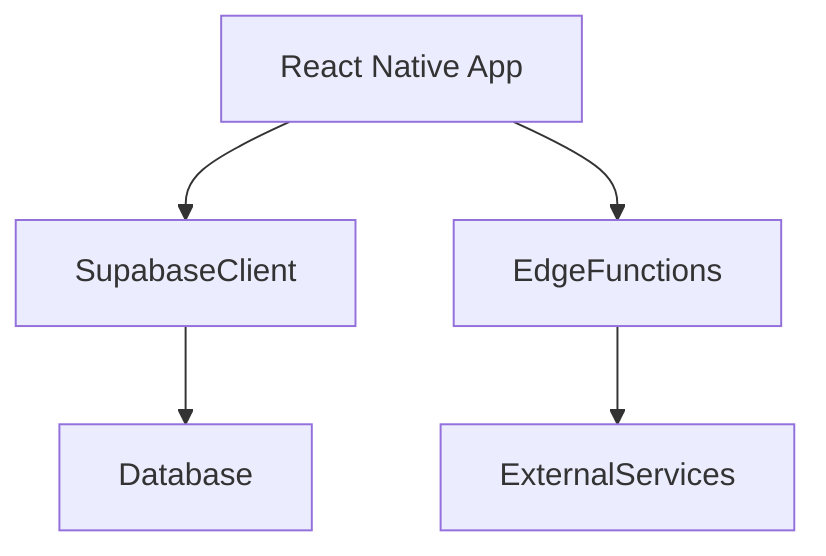

# 🌸 API Design

> *"The best APIs feel invisible, allowing features to communicate naturally and securely."*

---

# Introduction

BloomVault uses a hybrid API architecture.

Most application data is accessed directly through the Supabase client, while server-side operations are handled by Supabase Edge Functions.

This approach minimizes unnecessary backend complexity while providing the flexibility required for advanced platform capabilities.

---

# Purpose

The API Design aims to:

- Provide secure access to platform data.
- Support scalable feature development.
- Reduce unnecessary backend layers.
- Enable future integrations.
- Maintain clear separation between client and server responsibilities.

---

# API Architecture

BloomVault uses two complementary communication patterns.

Simple data access occurs through the Supabase client.

Advanced processing is delegated to Edge Functions.

---

# Direct Data Access

The majority of application features communicate directly with Supabase.

Examples include:

- Products
- Brands
- Ingredients
- Personal Library
- Collections
- Wishlist
- Routines
- Personal Notes

Database security is enforced through Row Level Security (RLS).

---

# Edge Functions

Edge Functions handle operations that should not execute on the client.

Examples include:

- AI-powered analysis
- Barcode processing
- External API integrations
- Scheduled synchronization
- Administrative operations

Keeping these operations server-side improves security and maintainability.

---

# Authentication

All API communication should respect the authenticated user's identity.

Authentication is managed through Supabase Auth and enforced by Row Level Security policies.

---

# Error Handling

API responses should provide:

- Clear success responses.
- Meaningful error messages.
- Consistent response formats.
- Appropriate HTTP status codes for Edge Functions.

Client applications should gracefully handle temporary failures.

---

# Security

API communication should:

- Require authenticated access where appropriate.
- Validate server-side operations.
- Protect sensitive data.
- Prevent unauthorized modifications.

Security policies should remain centralized and consistent.

---

# Performance

The API architecture should prioritize:

- Efficient queries.
- Pagination.
- Minimal payload sizes.
- Request batching where appropriate.
- Reduced network overhead.

Performance should improve the overall user experience without increasing complexity.

---

# Future Growth

The API architecture supports future capabilities including:

- AI services
- Barcode scanning
- Semantic search
- Community features
- Third-party integrations
- Administrative dashboards

Additional services should integrate without disrupting existing communication patterns.

---

# Design Decisions

BloomVault intentionally minimizes traditional REST endpoints.

By leveraging Supabase's client APIs for standard data access and reserving Edge Functions for advanced server-side operations, the platform reduces backend complexity while maintaining flexibility and security.

---

# API Design Summary

BloomVault combines direct client communication with secure server-side processing to create a lightweight yet powerful API architecture.

This approach aligns with the platform's principles of simplicity, scalability, and maintainability.

---

> **APIs should connect ideas, not create complexity.**

> **BloomVault**

> *Your Personal Beauty Library.*