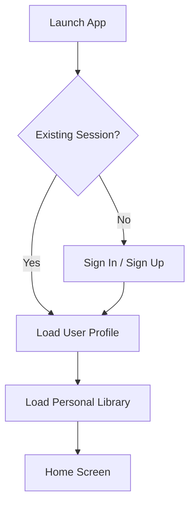

# 🌸 Authentication

> *"Every Personal Library begins with a trusted identity."*

---

# Introduction

Authentication allows BloomVault to securely identify users and protect their Personal Library.

Using Supabase Auth, the platform provides a secure and reliable authentication system without requiring custom identity infrastructure.

Authentication is the foundation for personalized experiences, secure data ownership, and privacy throughout the platform.

---

# Purpose

The Authentication architecture aims to:

- Verify user identity.
- Protect personal information.
- Enable secure access to user-owned data.
- Support personalized experiences.
- Simplify authentication management.

---

# Authentication Provider

BloomVault uses:

- Supabase Auth

Supabase manages authentication, session handling, password security, and identity verification.

---

# Supported Sign-In Methods

Version 1 supports:

- Email and Password
- Google Sign-In

Additional authentication providers may be introduced in future releases.

---

# Authentication Flow

Authentication occurs before loading user-specific information.

---

# User Identity

Each authenticated user has a unique identity managed by Supabase Auth.

The user identity is linked to:

- Profile
- Personal Library
- Collections
- Wishlist
- Routines
- Personal Notes
- Preferences

This relationship ensures that personal information remains isolated between users.

---

# Session Management

Supabase manages:

- Session creation
- Secure token refresh
- Session expiration
- Persistent login

Users should remain signed in unless they explicitly sign out or their session becomes invalid.

---

# Security

Authentication security includes:

- Encrypted communication
- Secure password handling
- JWT-based authentication
- Row Level Security (RLS)
- Protected user sessions

Sensitive authentication processes are managed by Supabase.

---

# Authorization

Authentication identifies users.

Authorization determines what users can access.

BloomVault enforces authorization through:

- Row Level Security policies
- Database permissions
- Authenticated user identity

Users may only access their own Personal Library and related private data.

---

# Error Handling

Authentication should gracefully handle:

- Invalid credentials
- Expired sessions
- Network failures
- Account verification issues

Error messages should be helpful without exposing sensitive security information.

---

# Future Growth

The authentication architecture supports future enhancements including:

- Apple Sign-In
- Multi-factor authentication (MFA)
- Passwordless authentication
- Magic links
- Biometric authentication
- Enterprise identity providers

These capabilities can be introduced without major architectural changes.

---

# Design Decisions

BloomVault delegates identity management to Supabase Auth rather than implementing a custom authentication system.

This reduces security risks, simplifies development, and allows the platform to focus on delivering value through its Beauty Catalog and Personal Library.

---

# Authentication Summary

Authentication provides the trusted identity that connects every user to their Personal Library.

By combining Supabase Auth with Row Level Security, BloomVault delivers secure, scalable, and privacy-focused authentication while minimizing operational complexity.

---

> **Your beauty journey belongs to you.**

> **BloomVault**

> *Your Personal Beauty Library.*