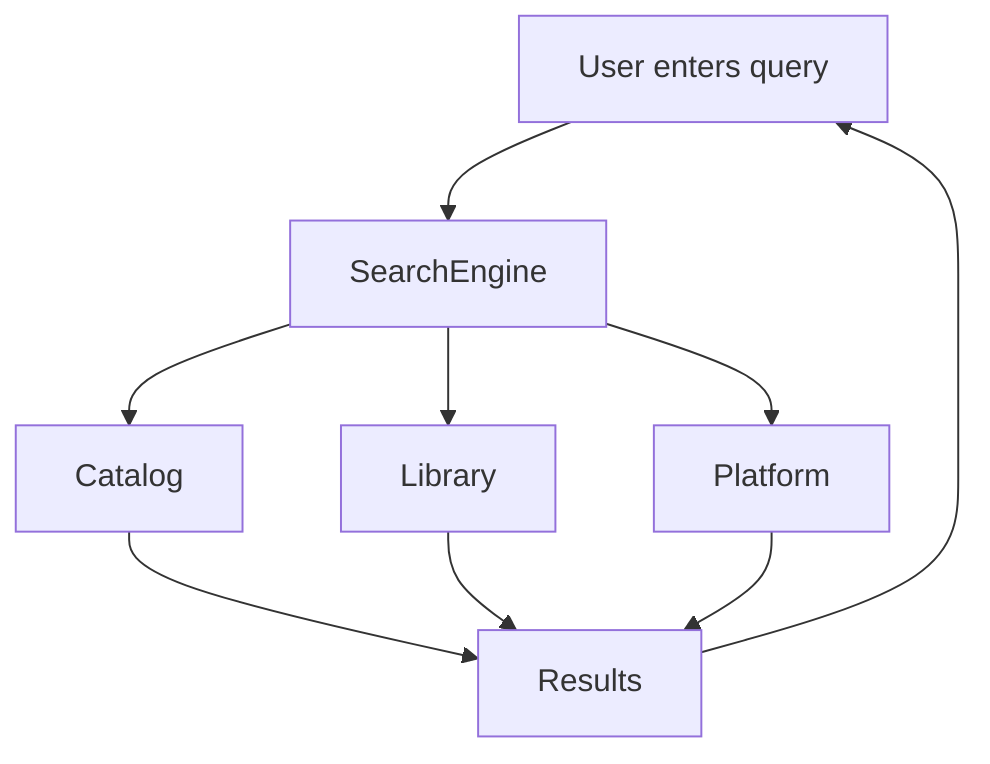

# 🌸 Search Architecture

> *"The value of knowledge depends on how easily it can be discovered."*

---

# Introduction

Search is one of BloomVault's core platform capabilities.

Rather than searching only products, BloomVault provides a unified search experience that helps users discover both shared beauty knowledge and their own Personal Library.

The Search Architecture is designed to remain fast, scalable, and extensible while supporting future AI-powered search capabilities.

---

# Purpose

The Search Architecture aims to:

- Enable fast information discovery.
- Search across multiple knowledge domains.
- Provide relevant ranked results.
- Support future semantic search.
- Improve navigation throughout the platform.

---

# Search Philosophy

BloomVault provides a single global search experience.

Users should not need to choose which type of information they are searching.

Instead, the platform searches across all supported domains and presents organized results.

---

# Search Domains

The search system spans three primary domains.

## 🌍 Beauty Catalog

Searches include:

- Products
- Brands
- Ingredients

---

## 📚 Personal Library

Searches include:

- Saved Products
- Collections
- Wishlist
- Routines
- Personal Notes

Only the authenticated user's personal content is searchable.

---

## ⚙️ Platform

Future searchable content may include:

- Help articles
- Tutorials
- Announcements
- Settings

---

# Search Flow

The Search Engine retrieves and organizes results from multiple knowledge domains before presenting them to the user.

---

# Ranking

Search results should prioritize:

- Exact matches
- Relevant matches
- Frequently accessed items
- Recently accessed personal content

Ranking strategies may evolve as the platform grows.

---

# Search Features

The search system supports:

- Instant search
- Search suggestions
- Recent searches
- Search history
- Result grouping
- Highlighted matches

Future enhancements may introduce semantic search and AI-assisted discovery.

---

# Security

Search must respect user permissions.

Requirements include:

- Personal Library searches are limited to the authenticated user.
- Shared Beauty Catalog content remains publicly searchable.
- Unauthorized data should never appear in search results.

Security policies should be enforced before results are returned.

---

# Performance

The search system should prioritize:

- Fast response times
- Indexed search
- Efficient ranking
- Incremental loading
- Minimal network overhead

Performance should remain consistent as the Beauty Catalog grows.

---

# Future Growth

The Search Architecture supports future capabilities including:

- Semantic search
- Natural language search
- AI-powered recommendations
- Voice search
- Barcode search
- Image-based search

These enhancements build upon the existing unified search model.

---

# Design Decisions

BloomVault intentionally adopts a single global search experience rather than separate searches for individual features.

This approach reflects the platform's philosophy of organizing knowledge around the user rather than around technical categories, making discovery simpler and more intuitive.

---

# Search Architecture Summary

The Search Architecture enables users to discover information across the Beauty Catalog and their Personal Library through one unified search experience.

By combining efficient indexing, domain-aware ranking, and future AI capabilities, BloomVault transforms search into a central navigation experience for the platform.

---

> **Knowledge is most valuable when it can be found effortlessly.**

> **BloomVault**

> *Your Personal Beauty Library.*