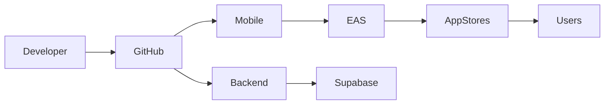

# 🌸 Deployment

> *"Reliable software reaches users through reliable delivery."*

---

# Introduction

Deployment is the process of delivering BloomVault from development into production.

The platform separates frontend and backend deployment, allowing each to evolve independently while maintaining a reliable user experience.

This approach supports rapid iteration, safe releases, and future platform growth.

---

# Purpose

The Deployment architecture aims to:

- Deliver reliable application releases.
- Separate frontend and backend deployments.
- Support multiple environments.
- Enable continuous improvement.
- Minimize deployment risk.

---

# Deployment Overview

BloomVault consists of two primary deployment targets.

## Mobile Application

The React Native application is distributed through:

- Apple App Store
- Google Play Store

Application builds are managed using Expo Application Services (EAS).

---

## Backend Platform

Backend services are deployed through Supabase.

These include:

- PostgreSQL Database
- Authentication
- Storage
- Edge Functions
- Security Policies

Backend updates can often be released independently of the mobile application.

---

# Deployment Flow

The deployment pipeline separates frontend and backend responsibilities while maintaining a unified development workflow.

---

# Deployment Environments

BloomVault supports multiple environments.

## Development

Used for active feature development.

---

## Staging

Used for testing before production releases.

---

## Production

Used by end users.

Changes should progress through these environments before reaching production whenever practical.

---

# Release Strategy

Application releases should prioritize:

- Incremental improvements
- Backward compatibility where possible
- Safe rollout of new features
- Reliable rollback procedures

Small, frequent releases reduce deployment risk.

---

# Over-the-Air Updates

Where supported by Expo, JavaScript and asset updates may be delivered using Over-the-Air (OTA) updates.

Native code changes require a new application build and store submission.

---

# Monitoring

Deployments should be monitored for:

- Build failures
- Runtime errors
- Crash reports
- Performance regressions
- Deployment success

Monitoring supports rapid detection of release issues.

---

# Future Growth

The deployment architecture supports future enhancements including:

- Automated CI/CD pipelines
- Feature flags
- Canary releases
- Blue-green deployments
- Automated rollback
- Regional deployments

These capabilities can be introduced as BloomVault grows.

---

# Design Decisions

BloomVault separates application delivery from backend deployment.

This architecture allows backend improvements to be released independently while leveraging Expo's deployment capabilities for efficient mobile application updates.

The deployment strategy emphasizes reliability, simplicity, and continuous delivery.

---

# Deployment Summary

The Deployment architecture provides a structured approach for delivering BloomVault to users.

By combining Expo, Supabase, GitHub, and staged deployment environments, BloomVault supports dependable releases while remaining flexible for future growth.

---

> **Great software deserves great delivery.**

> **BloomVault**

> *Your Personal Beauty Library.*